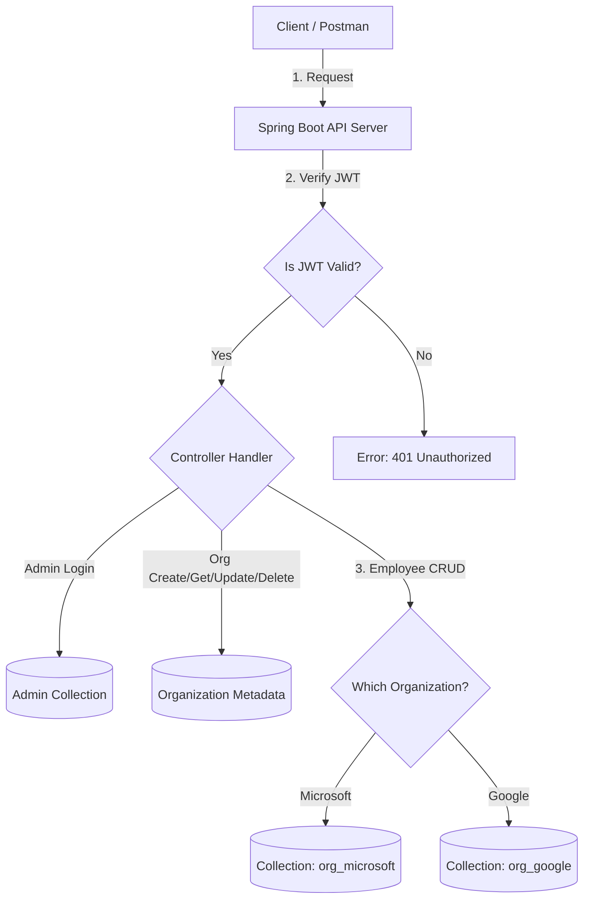

# Organization Service

**Backend**: Spring Boot (Java)

**Purpose**: Multi-tenant Organization Management service. Creates organizations, admin users and dynamic tenant collections in MongoDB. Implements JWT admin login and tenant-scoped employee CRUD (role-based access control).

### Documentation

[View Additional Question Pdf](ADDITIONAL_QUESTION.pdf)

---

## How It Works (Architecture)



---

## Design Choices (Why I built it this way)

- **Separation of global vs. tenant data**: A master database holds global metadata (organizations and admins), while each organization gets its own MongoDB collection. This keeps tenant data isolated and reduces the risk of cross-tenant mix-ups.

- **Dynamic tenant collection creation**: When a new organization is created, a dedicated org_<name> collection is generated and pre-filled with a small template document so the structure is visible and consistent from the start.

- **JWT-based authentication**: Admins receive a stateless JWT containing their admin ID, role, and organization name. Because the token carries the organization identifier, every request automatically knows which tenant it belongs to.

- **Simple role-based access**: Only authenticated admins can perform sensitive actions like deleting an organization. This keeps the security model minimal but effective.

- **Trade-offs**: Using one collection per tenant is great for clarity and isolation, but may not scale to thousands of organizations. JWT validation inside the app is fine for small systems but could be moved to an API gateway in a larger setup.

---

## Getting Started

### Clone the Repository

```bash
git clone https://github.com/aditya-620/TheWeddingCompany_Organization-Management-Service.git
cd organization-service
```

### Prerequisites

Make sure you have the following installed:

* Java 17+ (JDK 17 recommended)
* Maven 3.6+
* MongoDB (local) or Docker (to run MongoDB container)
* (Optional) Postman for API testing

Check versions:

```bash
java -version
mvn -v
mongosh --version   # if using mongosh
```

---

## Quick overview

* Master DB (`org_master_db`) stores global metadata:

  * `master_organizations`
  * `master_admins`

* For each organization created the service programmatically creates a tenant collection named `org_<sanitized_org_name>` and seeds it with a basic schema template and an `admin_profile` document.

* Authentication: Admin login returns a JWT token with claims: `sub` (adminId), `organization` and `role`.

* Tenant APIs use the token's `organization` claim to route requests to the appropriate tenant collection.

---

## Configuration

Edit `src/main/resources/application.properties` to match your environment. Example configuration used in this project:

```properties
# MongoDB - use URI style (Spring Boot 3+)
spring.data.mongodb.uri=mongodb://localhost:27017/org_master_db

# JWT secret - keep safe in production
app.jwt.secret=bdf89a41e923c77e2cd9f7b123aa64ff913cbb87d2f11c4efae8e7d334b09da2
app.jwt.expiration-ms=3600000

# Prevent default Spring Security in-memory user creation
spring.autoconfigure.exclude=org.springframework.boot.autoconfigure.security.servlet.UserDetailsServiceAutoConfiguration

# Optional: change server port (default 8080)
# server.port=8081
```
---

## Run MongoDB

### Local MongoDB

Start your local MongoDB service (platform-specific). The application will create the `org_master_db` automatically when it writes data.


## Build & Run (development)

From project root:

```bash
# build
mvn clean package

# run
mvn spring-boot:run
```

---

## API Endpoints (summary)

> Base URL: `http://localhost:8080` (or `{{baseUrl}}` if you use Postman environment)

### Organization & Admin (master)

* `POST /org/create`

  * Body JSON: `{ "organization_name": "Microsoft", "email": "admin@microsoft.com", "password": "Admin@1234" }`
  * Creates organization metadata, admin in `master_admins`, tenant collection `org_<name>` seeded with template and admin_profile.

* `GET /org/get?organization_name=<name>`

  * Fetches organization metadata from master DB.

* `PUT /org/update`

  * Body JSON: `{ "organization_name": "OldName", "new_organization_name": "NewName" }`
  * Renames organization, copies tenant collection data (and inserts template if empty), updates admin references and metadata.

* `DELETE /org/delete?organization_name=<name>`

  * Header: `Authorization: Bearer <JWT_TOKEN>` (Admin only; token must contain matching organization)
  * Deletes tenant collection, admin(s) and metadata.

* `POST /admin/login`

  * Body JSON: `{ "email": "admin@microsoft.com", "password": "Admin@1234" }`
  * Returns `{ "token": "<JWT>" }`.

---

## Postman

Import the provided `postman/OrganizationService.postman_collection.json`. Create an environment `Local` with variables:

```
baseUrl=http://localhost:8080
token_microsoft=
employeeId=
```

Flow to test:

1. `01 - Create Organization (Microsoft)`
2. `02 - Admin Login (Microsoft)` (this request auto-saves `token_microsoft`)
3. `03 - Create Employee` (uses Bearer `{{token_microsoft}}`)
4. `04 - List Employees` (auto-saves `employeeId`)
5. `05 - Get Employee` / `06 - Update Employee` / `07 - Delete Employee`

---